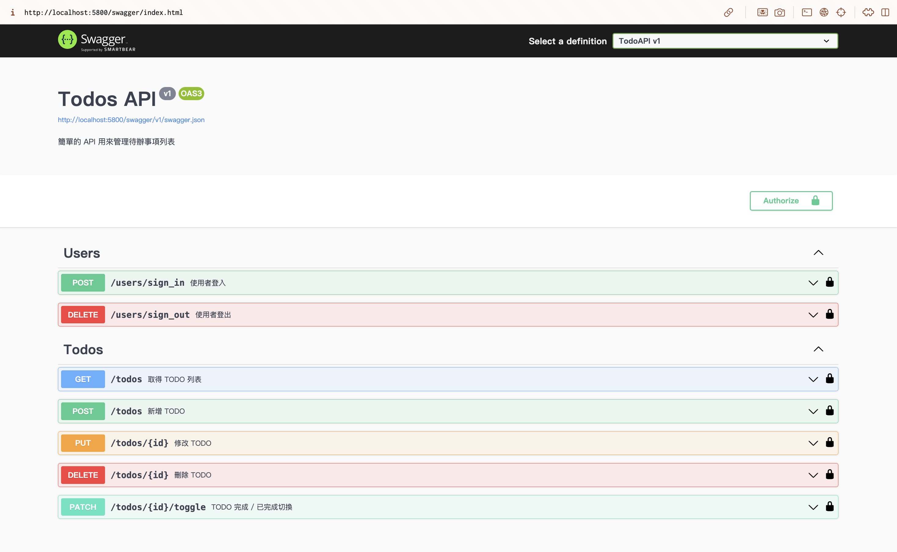
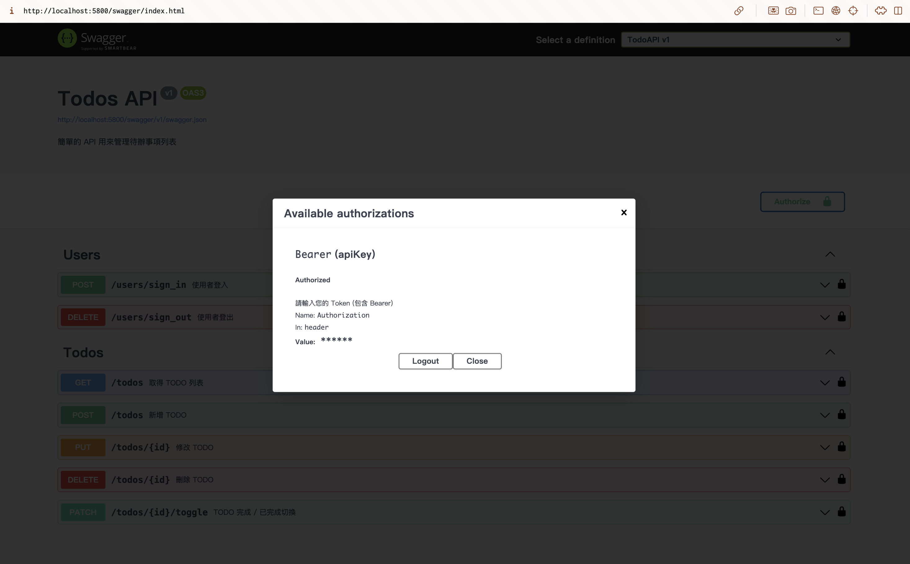

## 復刻一個 RESTFUL API 來管理 todos 列表
> 參考 https://todoo.5xcamp.us/api-docs/index.html 的 API 文件

#### Swagger 文件

#### 可使用路由：

#### Users
| 方法     | 路由 | 描述  |
| :--- | :--- | :--- |
| POST    | /users/sign_in | 使用者登入 | 
| DELETE  | /users/sign_out | 使用者登出 |
- 使用者如果為首次登入則會自動註冊一個新帳號做使用 

#### Todos
| 方法     | 路由 | 描述  |
| :--- | :--- | :--- |
| GET    | /todos | 取得 TODO 列表 |
| POST    | /todos | 新增 TODO |
| PUT  | /todos/{id} | 修改 TODO |
| DELETE  | /todos/{id} | 刪除 TODO |
| PATCH  | /todos/{id}/toggle | TODO 完成 / 已完成切換 |
---
### 專案的運行方式
1. 將專案 clone 到本地
`$ git clone https://github.com/KangPeiHsuan/TodoList_API.git`
2. 切換至專案目錄
`$ cd TodoList_API/TodoAPI`
3. 安裝 Nuget 套件(依照 `.csproj` 檔)
`$ dotnet restore`
4. 建立資料庫伺服器 (SQL Server)，並設定使用者帳號密碼
    - 下載 SQL Server 或其他介面軟體
    - 使用 Docker 運行 SQL Server > 我的作法：[[note] 使用 docker 在 mac 上運行 SQL Server](https://hackmd.io/@kangpei/SyNqnY3ekl)
    - 建立伺服器即可(資料庫可以透過後續指令生成)
5. 設定 `appsettings.json`
    - JwtSettings:SingKey 欄位可以輸入任意大於 32 字元長度的字串，會用於生成 Jwt
    - DeffaultConnection 欄位可以輸入剛剛你連線的資料庫資訊
6. 建立資料庫(依據遷移檔)
`$ dotnet ef database update`
7. 建立和運行專案
`$ dotnet run`
8. 跑起來後就會進入到 swagger 文件的頁面了！

### 專案結構
檔案主要分為:
- Controllers 負責處理 api 端點入口以及邏輯處理
- Models 負責處理類別模型以及資料庫上下文，處理數據並建立資料庫
- Dtos 這個類別用來簡化資料傳輸的內容
- Services / Providers 分別用來及中處理不同大小的功能

### 實作思路
1. 先設定好 api 路徑端點，確認需建立的模型類別 (Todo / User)
2. 建立模型類別、資料庫上下文，初始化遷移檔後，建立資料庫伺服器連線，並生成資料庫以及資料表(資料庫先連線後才能執行專案，進入 Swagger 頁面)
3. 處理邏輯控制器，先後完成 TodosController / UsersController 兩組不同路徑 api 端點
4. 使用 DTO 做資料傳輸的處理，因為考量模型資料並非所有都需要 / 可以暴露給使用者知道，所以利用 Dto 類別去做區分
5. 考量要有使用者身份認證及授權等在使用上較安全，於是放上 JWT 的處理功能，並使用 Swagger UI 的內建介面來做 Bearer 驗證
6. 因為沒有使用 Identity 功能，所以需手動處理資料區隔問題，在資料庫加上全局篩選做處理

---
### 實作筆記 (待完成)
[[note] Todos API 實作](https://hackmd.io/@kangpei/HJ_YC3hlJl)